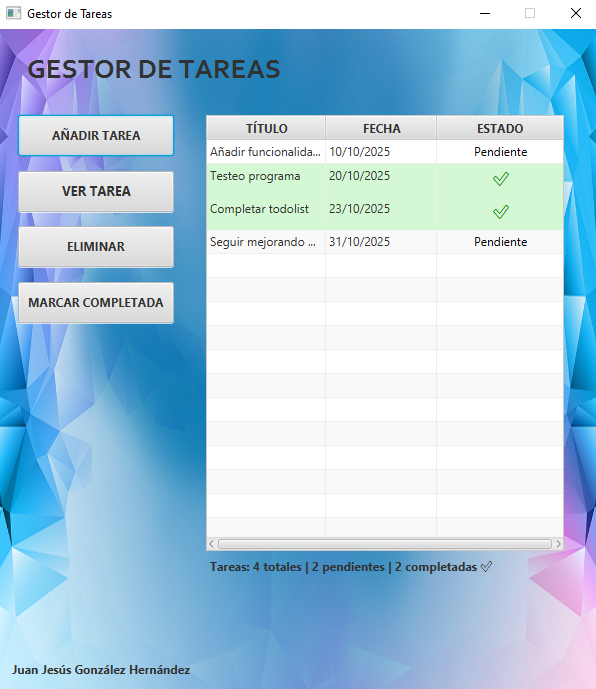

# Gestor de Tareas (To-Do List) - JavaFX

## Descripción
Aplicación de escritorio para gestionar tareas de manera sencilla y visual.  
Permite añadir, editar, eliminar y marcar tareas como completadas. Incluye persistencia de datos y una interfaz intuitiva.

---

## Tecnologías utilizadas
- **Lenguaje:** Java 25
- **Framework:** JavaFX 21
- **IDE:** IntelliJ IDEA Community Edition
- **Otros:** SceneBuilder 25.0.0 para diseño de interfaz, ControlsFX y FormsFX para componentes avanzados

---

## Funcionalidades principales
- Añadir nuevas tareas con título, descripción y fecha.
- Ver y editar tareas existentes en una ventana detallada.
- Marcar tareas como completadas con indicador visual.
- Eliminar tareas seleccionadas.
- Contador dinámico de tareas.
- Persistencia de datos en archivo local (serialización).
- Indicadores visuales de estado (colores para tareas completadas).

---

## Capturas de pantalla

---

## Cómo ejecutar
1. Clonar el repositorio.
2. Abrir el proyecto en IntelliJ IDEA.
3. Ejecutar `Main.java` como aplicación JavaFX.
4. Asegúrate de tener configurado JavaFX en el proyecto.

---

## Estructura del proyecto
- to-do-list/
- │
- ├- ─ src/main/java/com/example/todolist/
- │ ├─ Main.java
- │ ├─ controller/
- │ │ ├─ MainController.java
- │ │ ├─ AddTaskController.java
- │ │ └─ViewTaskController.java
- │ ├─ model/
- │ │ ├─ Task.java
- │ │ ├─util/
- │ │ └─FileManager.java
- │
- ├─ src/main/resources/com/example/todolist/
- │ ├─ main-view.fxml
- │ ├─ add-task-view.fxml
- │ ├─ styles.css
- │ └─ view-task.fxml
- ├─images/
- │
- └─ README.md
---

## Retos y aprendizajes
- Implementar **persistencia de datos** para mantener las tareas tras cerrar la aplicación.
- Diseñar una **interfaz visual clara** usando SceneBuilder y CSS.
- Manejar **observable lists y bindings** para actualizar la tabla automáticamente.
- Aplicar **indicadores visuales de estado** para mejorar la UX.

---

## Próximas mejoras
- Añadir **búsqueda y filtrado** de tareas.
- Exportar e importar tareas en **formato JSON o CSV**.
- Implementar **tema oscuro / claro**.
- Posible versión móvil o web para aumentar accesibilidad.

---

## Autor
Juan Jesús González Hernández